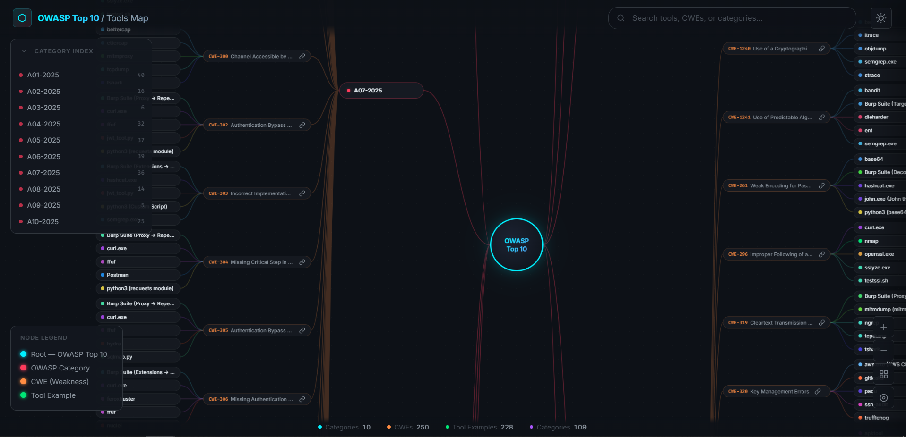
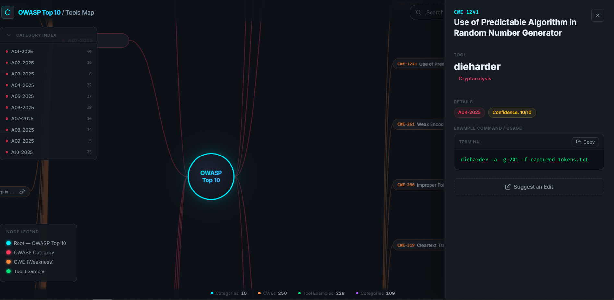
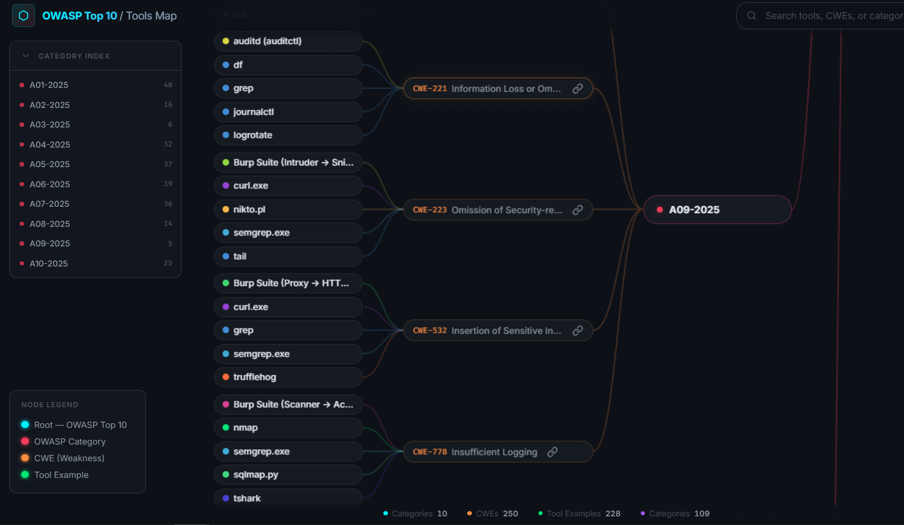

# OWASP Top 10 — Tools Mindmap

Toolmap that visualizes OWASP Top 10 categories, CWEs, and the security tools associated with them. This project maps numerous tool examples across the OWASP Top 10 framework.


## Command Examples


## CWEs mapped with tools


This is the second mindmap i published, this one maps OWASP Top 10 Category and their CWEs with Tools & Examples, it's always welcome for contributions, if you want to contribute you can use the following json format.

```json
{
    "ID": "CWE-1234",
    "Name": "Example Weakness",
    "ToolName": "Example Tool",
    "Category": "Vulnerability Scanner",
    "Tactic": "A01-2025",
    "ConfidenceScore": "9",
    "ExampleCommands": "example-tool -u https://target.com",
    "SituationalContext": "Scanning a target for Example Weakness"
}
